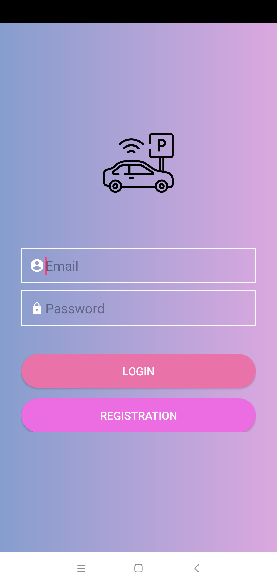
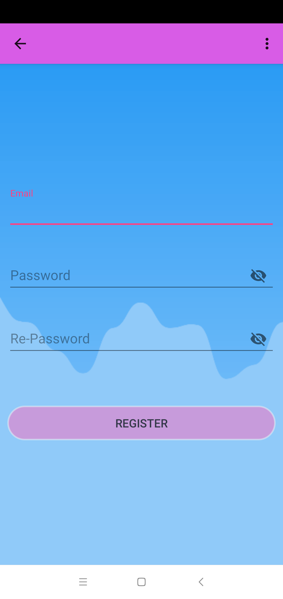
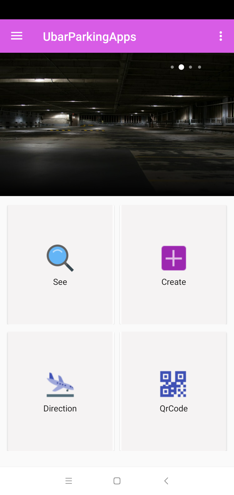
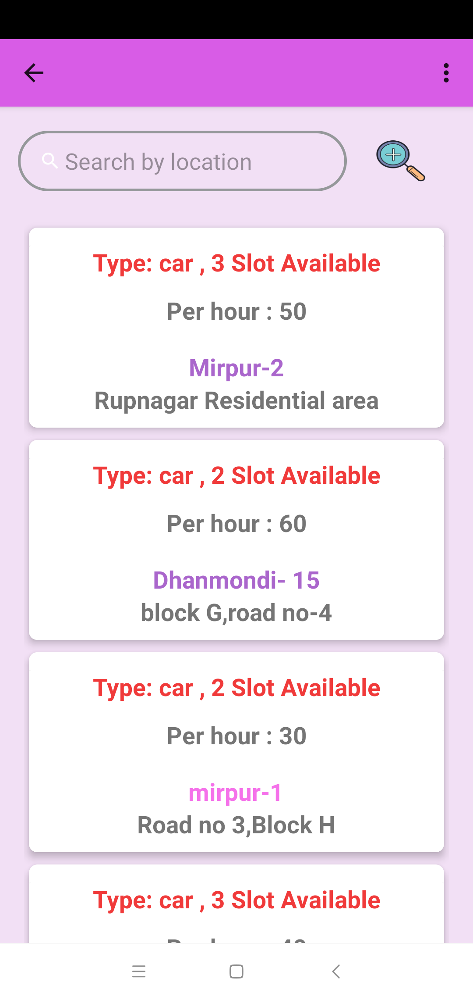
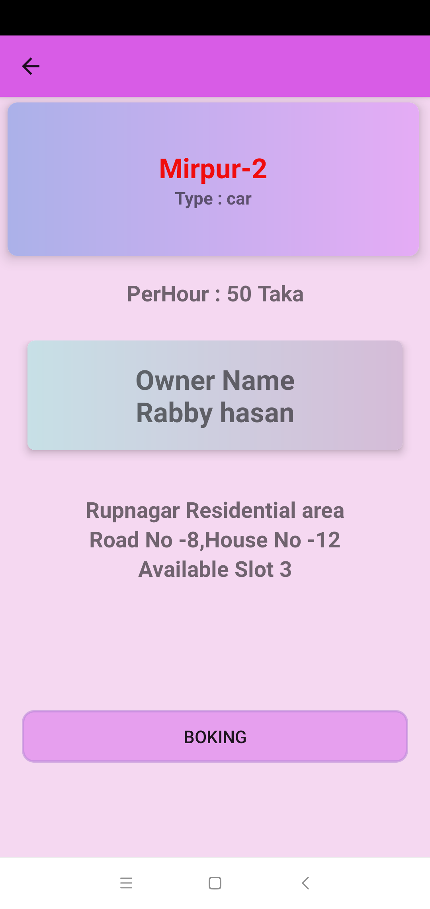
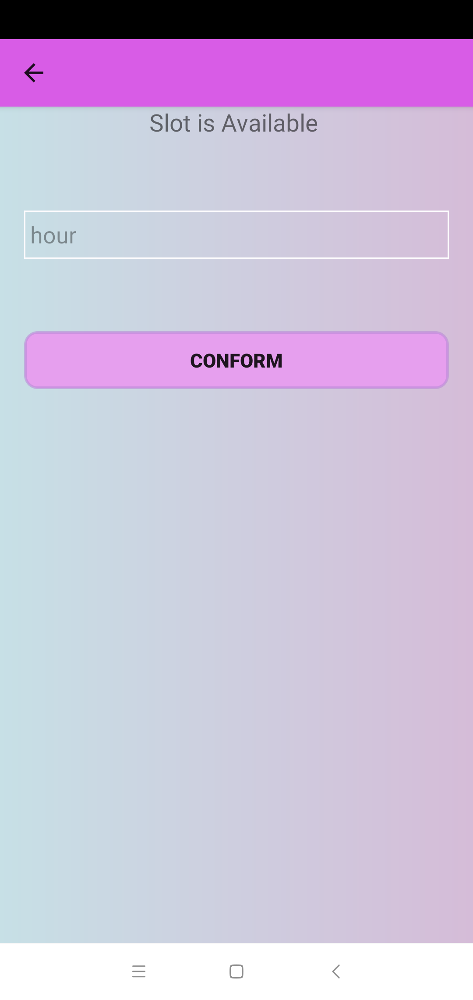
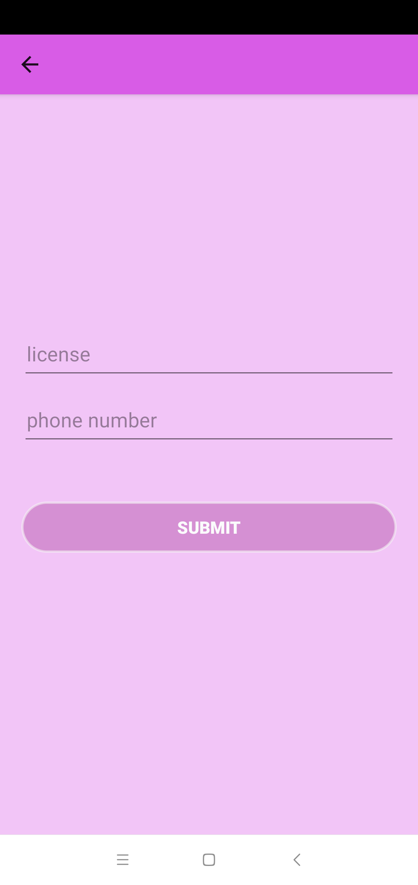
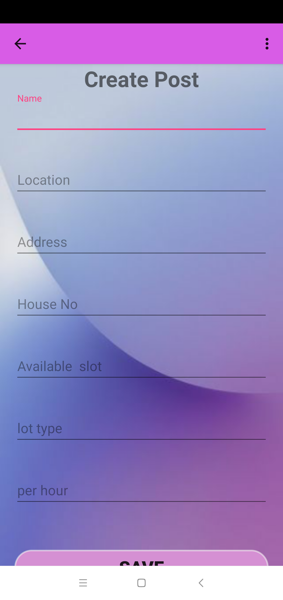
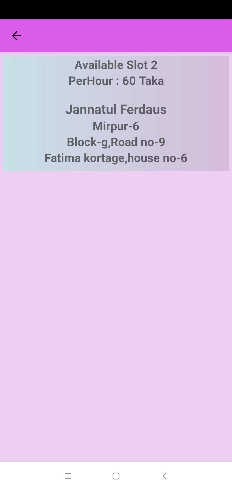

# CarParking

 Show a car parking list Using HttpGet Request  and Post Request from user to server 
  It’s a apps backend server using firebase. 
  
  
### Using firebase,Java ,Android stdio 

#

        

                     

        
